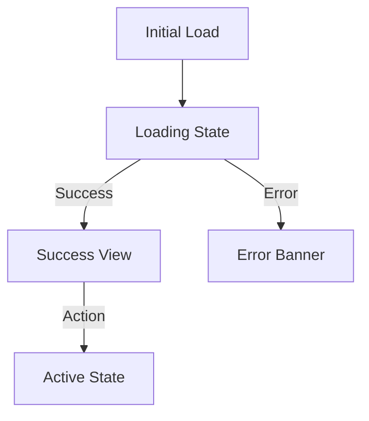

# Skill: 2-to-prd

Convert the completed discovery interview into a concise, actionable Product Requirements Document (PRD).

## Rules
- Only run after `/1-grill-me` is complete.
- Do not invent requirements not discussed in the interview.
- Deliver the PRD as a user-facing **Antigravity Artifact** (`write_to_file` with `user_facing: true` and `request_feedback: true`).
- Save the PRD to `docs/prd/<feature-name>.md`.

## PRD Artifact Schema

```markdown
# PRD: <Feature Name>

## Problem
One sentence summarizing the core user problem solved.

## Success Criteria
- [ ] Criterion 1
- [ ] Criterion 2

## User Stories
- As a <role>, I want to <action> so that <benefit>.

## Design Direction & UI Specs
- **Palette & Tokens**: Color variables and contrast ratios
- **Typography & Scale**: Font sizes and weights
- **Visual Tone**: Grimdark / Modern / Minimal / Refined
- **Interactions**: Motion, hover states, micro-animations
- **Responsive Layout**: Mobile vs Desktop viewport adaptations

## User Flow & State Diagram



## UI States Matrix
| State | Visual & Interactive Behavior |
|-------|-------------------------------|
| Loading | Skeleton loader / subtle pulse animation |
| Empty | Helpful guidance & call-to-action |
| Error | Non-blocking inline error message + retry action |
| Success | Full feature state rendered |

## Scope Boundaries
### In Scope
- Included components, interactions, and data structures.

### Out of Scope
- Explicitly excluded capabilities.

## Data Contracts
- **Inputs**: Component props, form fields, static data.
- **Outputs**: Rendered DOM, state updates, event callbacks.
- **Persistence**: localStorage or third-party service endpoints (if applicable).

## Edge Cases
- Long text strings, empty datasets, network timeouts, offline states.

## Open Questions
- Any remaining ambiguities flagged for user feedback.
```

## Confidence Gate
Run `.agents/skills/shared/confidence-gate.md` before finalizing the PRD. Ensure target confidence is **95%+**.

## When Done
Output the summary:
```
PRD COMPLETE

Saved Artifact to: docs/prd/<feature-name>.md

Ready to run /3-to-issues
```
