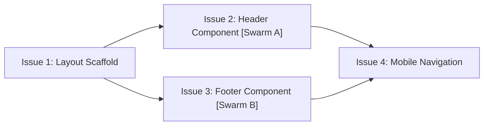

# Skill: 3-to-issues

Decompose a PRD into vertical-slice implementation tasks that deliver independently testable, visible user value.

## Rules
- Read `docs/prd/<feature-name>.md` before generating issues.
- Each issue must be a **vertical slice** (delivering visible functionality end-to-end).
- Small scope: each issue must fit comfortably into a single TDD session.
- Save each issue file as `docs/issues/<feature-name>/<number>-<slug>.md`.
- Automatically create corresponding GitHub Issues via `gh issue create`.

## Vertical Slice Rule
For frontend-only projects (per `AGY.md`), a vertical slice delivers a visible, accessible, testable UI component or feature interaction:
- ❌ Horizontal (Wrong): "Build all SCSS variables," "Write all TypeScript interfaces."
- ✅ Vertical (Correct): "Render Header component with navigation tabs, responsive toggle, and jest-axe test suite."

## Issue Markdown Template

```markdown
# Issue <number>: <Title>

## What
One sentence description of what this ticket delivers.

## Why
User value or technical prerequisite.

## Acceptance Criteria
- [ ] Criterion 1
- [ ] Criterion 2
- [ ] Criterion 3

## Layers Touched
- [ ] Frontend — <components, SCSS modules, hooks>
- [ ] Tests/a11y — <Jest/RTL unit tests, jest-axe assertion>

## Edge Cases
- Edge case → expected behavior

## Blocked By
- List parent issue dependencies (or "None").

## Definition of Done
- [ ] Implementation complete per fe-standards.md
- [ ] Unit tests passing (`npm test`)
- [ ] Red-green TDD verified
- [ ] jest-axe passing on every distinct render state
```

## GitHub Issue Auto-Creation
After writing markdown files to `docs/issues/<feature-name>/`, create GitHub Issues:

```bash
gh issue create \
  --title "<issue title>" \
  --body "$(cat docs/issues/<feature-name>/<number>-<slug>.md)" \
  --label "vertical-slice"
```

## Dependency Graph Visualization & Parallelization Swarm Strategy
Generate a Mermaid dependency chart and tag issues that are parallelizable (i.e. have no blocking parent dependencies):



### Parallel Subagent Swarm Execution Matrix
Identify unblocked parallel branches in the dependency graph so `/4-tdd` can dispatch concurrent subagents via `invoke_subagent`:
| Issue | Status | Can Run Concurrently? | Subagent Swarm Role |
|-------|--------|----------------------|----------------------|
| Issue 1 | Unblocked | No (Root Dependency) | Lead Agent |
| Issue 2 | Blocked by #1 | Yes (with Issue #3) | Subagent Swarm A |
| Issue 3 | Blocked by #1 | Yes (with Issue #2) | Subagent Swarm B |

## Confidence Gate
Run `.agents/skills/shared/confidence-gate.md` to ensure 95%+ confidence before finalizing.

## When Done
```
ISSUES COMPLETE

Generated <n> issue tickets in docs/issues/<feature-name>/
GitHub Issues created: <issue links>

Dependency Graph & Parallel Swarm Matrix rendered.
Ready to run /4-tdd on Issue 1 (or parallel subagent swarms for unblocked issues)
```
