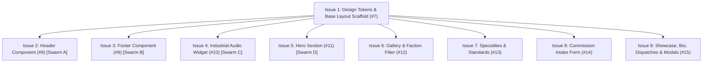

# Dependency Graph & Parallel Subagent Swarm Execution Matrix

## Mermaid Dependency Chart

---

## Parallel Subagent Swarm Execution Matrix

| Ticket | GitHub Issue | Status | Concurrently Runnable? | Subagent Swarm Role |
| :--- | :--- | :--- | :--- | :--- |
| **Issue 1** | [#7](https://github.com/rmrose78/never-go-full-dave-portfolio/issues/7) | Unblocked | No (Root Scaffold) | Lead Agent |
| **Issue 2** | [#8](https://github.com/rmrose78/never-go-full-dave-portfolio/issues/8) | Blocked by #7 | Yes (with #9, #10, #11) | Subagent Swarm A |
| **Issue 3** | [#9](https://github.com/rmrose78/never-go-full-dave-portfolio/issues/9) | Blocked by #7 | Yes (with #8, #10, #11) | Subagent Swarm B |
| **Issue 4** | [#10](https://github.com/rmrose78/never-go-full-dave-portfolio/issues/10) | Blocked by #7 | Yes (with #8, #9, #11) | Subagent Swarm C |
| **Issue 5** | [#11](https://github.com/rmrose78/never-go-full-dave-portfolio/issues/11) | Blocked by #7 | Yes (with #8, #9, #10) | Subagent Swarm D |
| **Issue 6** | [#12](https://github.com/rmrose78/never-go-full-dave-portfolio/issues/12) | Blocked by #7 | Yes (with #13, #14, #15) | Subagent Swarm E |
| **Issue 7** | [#13](https://github.com/rmrose78/never-go-full-dave-portfolio/issues/13) | Blocked by #7 | Yes (with #12, #14, #15) | Subagent Swarm F |
| **Issue 8** | [#14](https://github.com/rmrose78/never-go-full-dave-portfolio/issues/14) | Blocked by #7 | Yes (with #12, #13, #15) | Subagent Swarm G |
| **Issue 9** | [#15](https://github.com/rmrose78/never-go-full-dave-portfolio/issues/15) | Blocked by #7 | Yes (with #12, #13, #14) | Subagent Swarm H |
