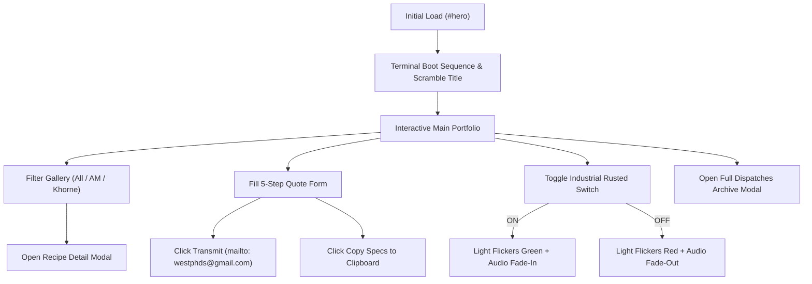

# PRD: Never Go Full DAVE Miniature Painting Studio Portfolio

## Problem
Warhammer 40k and Age of Sigmar miniature collectors and gaming enthusiasts need a high-impact, visual-first portfolio to evaluate Dave's painting craftsmanship, inspect quality standards, and instantly submit structured commission quote requests.

---

## Success Criteria
- [ ] Render a conversion-first 8-section layout (`Hero` $\rightarrow$ `Gallery` $\rightarrow$ `Specialties` $\rightarrow$ `Standards` $\rightarrow$ `Commission Form` $\rightarrow$ `Showcase` $\rightarrow$ `Bio` $\rightarrow$ `Dispatches`).
- [ ] Provide interactive faction filtering (All, Astra Militarum, Khorne Chaos) for painted squad and centerpiece model cards.
- [ ] Deliver a 5-step interactive commission quote intake form pre-formatting a mailto link to `westphds@gmail.com` with a "Copy Inquiry to Clipboard" fallback.
- [ ] Render a fixed bottom-right rusted industrial audio widget with an abandoned warehouse flickering light bulb (emerald green ON / crimson red OFF) and volume envelope fade-in/out.
- [ ] Achieve 95%+ test coverage across custom hooks (`src/hooks/`), pure utility functions (`src/utils/`), and React components using Vitest, React Testing Library, and jest-axe.

---

## User Stories
- **As a prospective commission client**, I want to review Dave's painting standards and pricing averages so that I can decide which quality tier matches my budget.
- **As a Warhammer collector**, I want to filter painted models by faction so that I can inspect edge highlights, weathering, and basing relevant to my army.
- **As a client ready to order**, I want to fill out a structured intake form so that Dave receives all necessary model details (army, quantity, assembly state, quality tier) in a single email.
- **As a site visitor**, I want to toggle an industrial techno background loop via a tactile rusted toggle switch so that I can experience the studio's grimdark audio atmosphere.

---

## Design Direction & UI Specs

### Color Tokens & Palette
* **Void Base**: `#080706` (Primary background), `#100f0d` (Surface dark), `#181614` (Card background)
* **Text**: `#ece9e2` (High contrast primary text, 16.5:1 ratio), `#a49f94` (Muted secondary text, 6.8:1 ratio)
* **Brass Metallic**: `#d4b265` (Accent gold/brass), `rgba(212, 178, 101, 0.4)` (Glow)
* **Ember Orange**: `#ff6e4a` (Secondary accent / Khorne highlight)
* **Tactical Signal**: `#6ee5cc` (Emerald signal light / Reticle lock)

### Typography & Scale
* **Display Font**: `"Chakra Petch"`, sans-serif (Headers, titles, kicker labels)
* **Body Font**: `"Inter"`, sans-serif (Paragraphs, features, body prose)
* **Mono Font**: `"Space Mono"`, monospace (Telemetry readout, boot logs, tags)

### Studio Branding & Icons
* **Studio Emblem**: Iron Halo & Crossed Paintbrushes (`favicon.svg`) rendered in Navbar, Hero, and Footer.
* **Navbar Title**: **Never Go Full DAVE** (Gold accent on `DAVE`).

### Industrial Audio Control Panel (Bottom-Right Fixed)
* **Placement**: `position: fixed; bottom: 1.5rem; right: 1.5rem; z-index: 120;`
* **Styling**: Rusted iron gradient plate with corner rivets and metallic speaker grill SVG.
* **Gloomy Warehouse Bulb**:
  * **AUDIO ON**: Dark gloomy emerald green (`#059669` / `#10b981`) flickering erratically.
  * **AUDIO OFF**: Dark gloomy crimson red (`#8e1818` / `#991b1b`) flickering erratically.
* **Vertical Rusted Switch**: 3D rusted toggle lever shifting UP for `ON` and DOWN for `OFF`.

---

## User Flow & State Diagram



---

## UI States Matrix

| Component State | Visual & Interactive Behavior |
| :--- | :--- |
| **Initial Boot** | Terminal log sequence types in hero box followed by title scramble reveal and purity seal stamp |
| **Gallery Default** | All 6 painted squad and character cards displayed in responsive column grid |
| **Gallery Filtered** | Non-matching faction cards smoothly hide (`.is-hidden`), active tab highlighted in brass |
| **Audio OFF** | Bottom-right rusted widget lever down, gloomy bulb flickering red, audio muted |
| **Audio ON** | Bottom-right rusted widget lever up, gloomy bulb flickering emerald green, audio loop fading in (0.4 vol) |
| **Modal Open** | Background blurred (`backdrop-filter`), escape key closes, focus trapped inside modal |
| **Intake Form Valid**| Pre-fills mailto link to `westphds@gmail.com` with formatted parameters |

---

## Scope Boundaries

### In Scope
* 8-section responsive layout built in React (`src/components/{layout,sections,ui}/`).
* React Context and custom hooks (`src/hooks/`) for audio playback, intake form, and modal dialogs.
* Strongly-typed static dataset (`src/data/portfolio.ts`, `src/data/pricing.ts`, `src/data/dispatches.ts`).
* SCSS Modules (`*.module.scss`) for component-scoped styling.
* Vitest + React Testing Library + jest-axe unit tests with near 100% coverage target.
* Native AGY Chrome CDP visual verification and accessibility sweeps.

### Out of Scope
* Backend server or database (Frontend-only per `AGY.md`).
* E-commerce shopping cart or checkout payment gateway.
* User account registration or authentication.

---

## Data Contracts & Component Architecture

### Component Directory Map
```
src/
├── components/
│   ├── layout/       # Header, Footer, Navigation, Container
│   ├── sections/     # Hero, Gallery, Specialties, Standards, CommissionForm, Showcase, AboutBio, Dispatches
│   └── ui/           # Button, Card, Badge, Modal, IndustrialAudioWidget
├── context/          # StudioAudioContext, ModalContext
├── hooks/            # useIndustrialAudio, useCommissionWizard, useFactionFilter
├── data/             # portfolio.ts, pricing.ts, dispatches.ts (TypeScript constants)
├── utils/            # mailtoBuilder.ts, clipboard.ts, audioEnvelope.ts (Pure 100% covered utils)
└── styles/           # _variables.scss, _mixins.scss, index.scss
```

### Key Data Interfaces (`src/types/index.ts`)
```typescript
export interface PortfolioItem {
  id: string;
  title: string;
  faction: 'am' | 'kh';
  factionLabel: string;
  categoryBadge: string;
  aspectRatio: 'landscape' | 'portrait';
  bgClass: string;
  recipeKicker: string;
  recipeDetails: string;
}

export interface CommissionQuoteSpec {
  army: string;
  unitType: string;
  assemblyCondition: string;
  targetTier: string;
  customNotes: string;
}
```

---

## Edge Cases & Mitigation
* **Audio Autoplay Block**: Browsers block unprompted audio; audio requires user click on rusted toggle switch.
* **Clipboard API Unavailable**: Fallback to standard `document.execCommand('copy')` if `navigator.clipboard` is restricted.
* **Reduced Motion (`prefers-reduced-motion: reduce`)**: Disable canvas entry burst, particle drift, and flicker animations if user prefers reduced motion.
* **Narrow Viewports (<375px)**: Ensure mobile navigation drawer overlays cleanly and rusted audio widget stays docked in bottom corner without overlapping text.

---

## Open Questions
* None. All visual, architectural, and data decisions are 100% resolved and verified.
